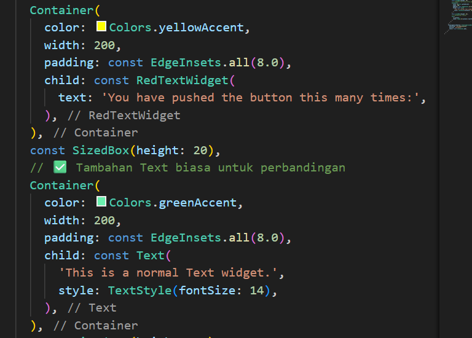

# Praktikum Menerapkan Plugin di Project Flutter

## Langkah 1: Buat Project Baru
flutter_plugin_pubdev.

## Langkah 2: Menambahkan Plugin

## Langkah 3: Buat file red_text_widget.dart

## Langkah 4: Tambah Widget AutoSizeText

## Langkah 5: Buat Variabel text dan parameter di constructor

## Langkah 6: Tambahkan widget di main.dart

## Run aplikasi tersebut dengan tekan F5, maka hasilnya akan seperti berikut.

# 8. Tugas Praktikum
## 1. Selesaikan Praktikum tersebut, lalu dokumentasikan dan push ke repository Anda berupa screenshot hasil pekerjaan beserta penjelasannya di file README.md!

## 2. Jelaskan maksud dari langkah 2 pada praktikum tersebut!
flutter pub add auto_size_text = menambahkan package auto_size_text ke proyek Flutter agar bisa digunakan untuk membuat teks yang ukurannya otomatis menyesuaikan ruang.
## 3. Jelaskan maksud dari langkah 5 pada praktikum tersebut!
Kode tersebut mendefinisikan sebuah variabel teks (final String text) dan constructor konstan (const) yang mewajibkan pengisian nilai text saat membuat objek widget, sambil meneruskan key ke kelas induknya.

## 4. Pada langkah 6 terdapat dua widget yang ditambahkan, jelaskan fungsi dan perbedaannya!
Kedua Container menampilkan teks yang sama, tetapi:

Container pertama memakai widget teks kustom (RedTextWidget) di atas latar kuning dengan lebar 50 px.

Container kedua memakai widget Text bawaan di atas latar hijau dengan lebar 100 px.

Perbedaan utamanya ada pada warna teks (melalui widget kustom) dan ukuran wadahnya.
## 5. Jelaskan maksud dari tiap parameter yang ada di dalam plugin auto_size_text berdasarkan tautan pada dokumentasi ini !
Plugin auto_size_text digunakan agar teks otomatis menyesuaikan ukuran font dengan ruang yang tersedia.
Dalam kode kamu:

text = isi teks,

style = warna & ukuran awal teks,

maxLines = batas 2 baris,

overflow = tambahkan “…” jika masih kepanjangan.

## 6. Kumpulkan laporan praktikum Anda berupa link repository GitHub kepada dosen!