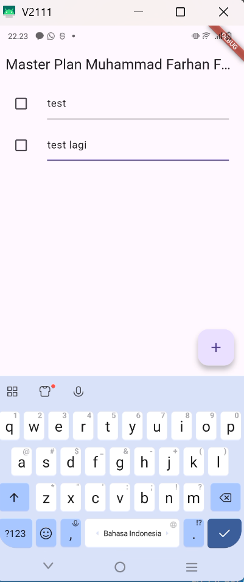
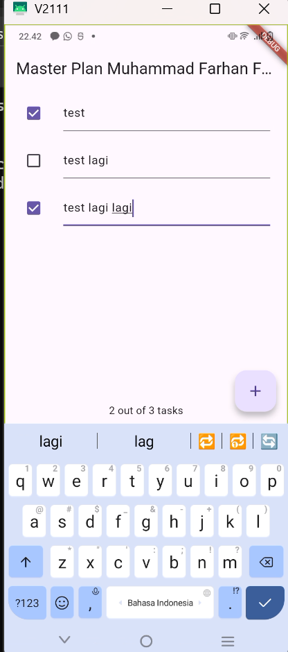
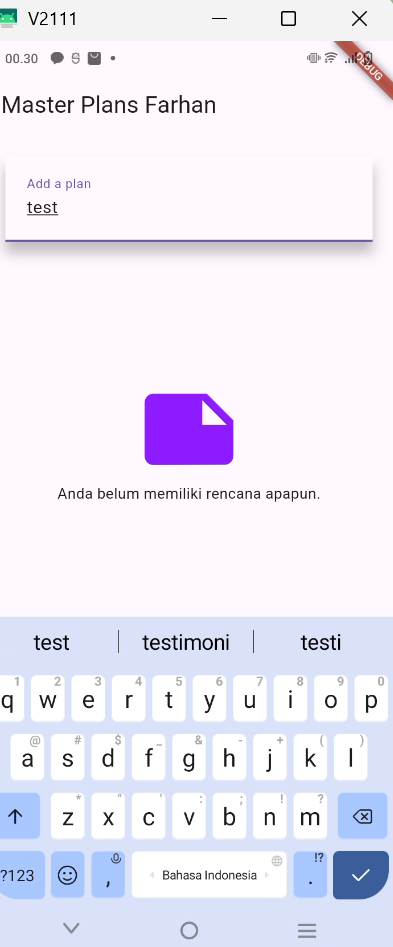

## 👤 Identitas
**Nama:** [Muhammad Farhan Fahraby]  
**NIM:** [2341720188]  
**Mata Kuliah:** Praktikum Pemrograman Mobile  

---

#  Praktikum 1: Dasar State dengan Model-View

##  Tujuan
Mempelajari dasar pengelolaan state pada Flutter menggunakan pendekatan Model–View melalui class `Task` dan `Plan`.

---

##  Hasil Akhir
hasil aplikasi:

Aplikasi dapat menambah task, menandai tugas selesai, serta melakukan scroll dengan lancar.

---

## Jawaban Pertanyaan

**2. Maksud Langkah 4:**  
File `data_layer.dart` dibuat agar semua model bisa diekspor dalam satu tempat, sehingga proses import di file lain lebih ringkas dan rapi.

**3. Variabel `plan` di Langkah 6:**  
`plan` menyimpan seluruh daftar tugas. Dideklarasikan sebagai konstanta karena nilai awalnya tetap (kosong) dan akan diperbarui melalui `setState()`.

**4. Penjelasan Langkah 9:**  
Langkah ini membuat daftar dinamis menggunakan `ListView.builder` yang menampilkan setiap task dengan `Checkbox` dan `TextFormField` agar bisa diubah dan ditandai selesai.

**5. Kegunaan Langkah 11 & 13:**  
- `initState()` menginisialisasi `ScrollController` dan menutup keyboard saat scroll.  
- `dispose()` membersihkan controller saat widget dihapus, mencegah kebocoran memori.

---

---

## Jawaban Pertanyaan Praktikum 2

### 1️ Apa yang dimaksud dengan `InheritedWidget`?
**InheritedWidget** adalah widget yang memungkinkan data dibagikan ke seluruh widget turunannya **tanpa harus diteruskan secara manual melalui konstruktor**.  
Dengan kata lain, widget turunan dapat langsung mengakses data dari `InheritedWidget` menggunakan `context`, tanpa harus menyimpannya secara eksplisit.

---

### 2️ Mengapa digunakan `InheritedNotifier`?
**InheritedNotifier** digunakan karena lebih cocok untuk data yang bersifat **dinamis atau dapat berubah sewaktu-waktu**.  
Ketika data yang dibungkus `InheritedNotifier` berubah (misalnya daftar tugas pada `Plan` bertambah atau berubah statusnya), maka seluruh widget yang bergantung pada data tersebut akan **otomatis diperbarui (rebuild)** tanpa memanggil `setState()` secara manual.  
Hal ini membuat aplikasi menjadi lebih **efisien, reaktif, dan terstruktur**.

---

### 3️ Apa maksud dari method pada langkah 3?
Pada langkah 3 digunakan **`ValueListenableBuilder`**, yang memiliki dua fungsi utama:
- Mendengarkan perubahan data pada `ValueNotifier`.
- Membangun ulang tampilan (`UI`) hanya pada bagian yang terpengaruh oleh perubahan data tersebut.

Dengan cara ini, **UI akan selalu sinkron dengan data terbaru** tanpa perlu memanggil `setState()` pada seluruh halaman.  
Pendekatan ini membuat aplikasi **lebih efisien dan responsif**, terutama ketika data yang diubah hanya sebagian kecil dari keseluruhan tampilan.

##  Hasil Akhir

---

## Praktikum 3 - Mengelola Data Layer dengan InheritedWidget dan InheritedNotifier

## Deskripsi Praktikum
Pada praktikum ini, kita belajar mengelola data di Flutter menggunakan **InheritedWidget** dan **InheritedNotifier** sebagai metode *state management sederhana*.  
Tujuannya adalah agar data dapat diakses dan diperbarui oleh widget-widget yang berada di bawahnya dalam *widget tree*, tanpa harus mengoper data melalui konstruktor secara manual.

---

## 
Berikut hasil akhir dari aplikasi yang telah dibuat pada praktikum ini:

## Penjelasan Diagram
> Aplikasi berawal dari **PlanCreatorScreen**, tempat pengguna membuat rencana baru.  
> Setelah menekan tombol navigasi, akan diarahkan ke **PlanScreen** yang menampilkan daftar task dan status penyelesaiannya.  
> Data antar-layar tetap tersimpan karena dikelola oleh **PlanProvider**.

