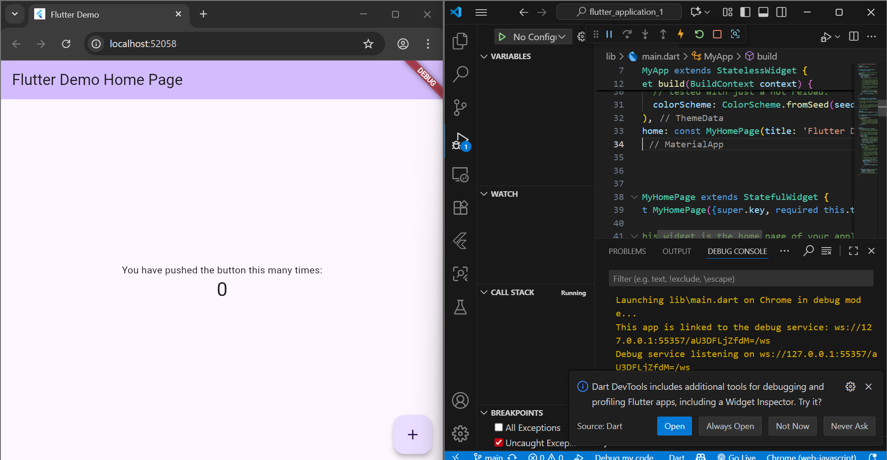
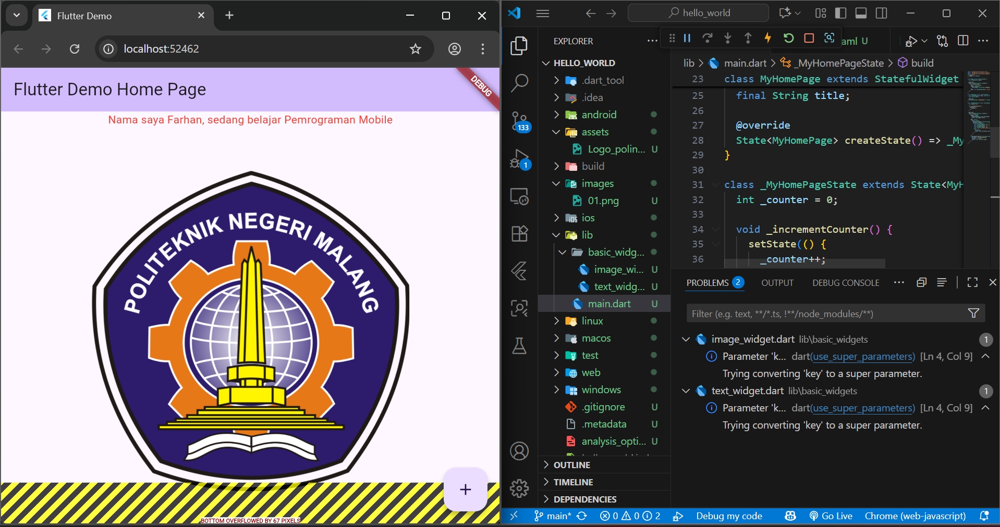

# hello_world
a new fluutter

# Menerapkan Widget Dasar
praktikum ini nerupakan cara menerapkan widget dasar

# Menerapkan Widget Material Design dan iOS Cupertino

 Cupertino Button dan Loading Bar  Floating Action Button (FAB)
 

Scaffold Widget & Dialog Widget
 

 

 Date & Time Pickers
 caffold Widget & Dialog Widget
 
